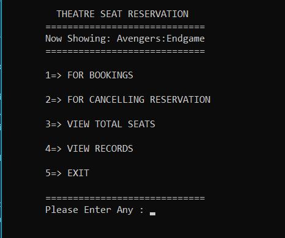
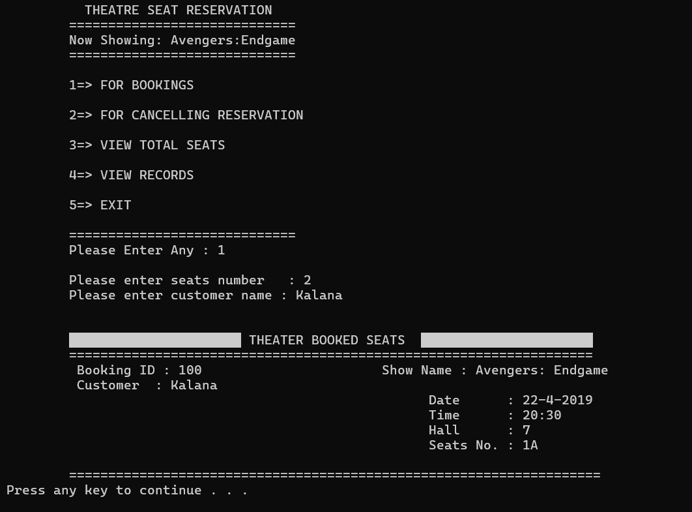

# Theatre Seat Reservation System

This mini project is a console-based Theatre Seat Reservation System developed using the C++ programming language. It simulates a basic ticket booking experience, allowing users to view available seats, reserve them, cancel reservations, and track booking records—all through a structured, menu-driven interface.
Designed for clarity and ease of use, the system leverages arrays, classes, and functions to manage seat layouts, reservation status, and user interactions. It’s an ideal project for beginners learning C++, as it introduces core programming concepts like object-oriented design, loops, conditionals, and modular architecture.
Whether you're building it for academic practice or as a foundation for a more advanced booking system, this project demonstrates how to manage real-world data in a clean, interactive, and scalable way.

<p align="center">
<a href="https://www.w3schools.com/html/" target="_blank" rel="noreferrer">  </a> 


## 📦 Features

- **🎫 Reserve Seats** : Users can select and book seats by seat number from the available layout.
- **❌ Cancel Reservations** : Allows users to cancel previously reserved seats and free them up.
- **📊 Display Available Seats** : Shows the current seat map and total number of unreserved seats.
- **🗂️ View Reservation Records** :Lists all booked seats with relevant details for tracking and review.
- **🛠️ Dynamic Seat Layouts** : Supports flexible seat arrangements for different theatre sizes.
- **🧠 Menu-Driven Interface** : Easy-to-navigate terminal UI with numbered options for each action.

## 📸 Preview

<table>
  <tr>
    <td></td>
    <td></td>
    
  </tr>
  <tr>
    <td align="center">Home</td>
    <td align="center">Booking</td>  
  </tr>
</table>

## ⚙️ Installation Instructions

### 🔧 Prerequisites

- A C compiler (GCC recommended)
- On **Windows**, install [MinGW](https://sourceforge.net/projects/mingw/) to compile C programs
- On **Linux/macOS**, GCC is usually pre-installed or available via package manager

## 🖥️ How to Install MinGW (Windows)

1. Download MinGW from [SourceForge](https://sourceforge.net/projects/mingw/)
2. During installation, select:
   - `mingw32-gcc-g++`
   - `mingw32-gcc`
3. Add MinGW’s `bin` folder to your system’s **PATH**:

4. Open Command Prompt and verify installation:
```bash
g++ --version
```

## 🚀 How to Compile and Run

### 📥 Clone the Repositor

Clone the repository :

```sh
git clone https://github.com/DarkFeed2005/Theatre-Seat-Reservation-System-C-.git
```
```bash
cd Theatre-Seat-Reservation-System-C-
```
### 🛠️ Compile the Program

#### On Windows (with MinGW):
```bash
g++ main.cpp -o Theatre-Seat-Reservation-System-C-.exe
```

#### On Linux/macOS:
```bash
g++ main.cpp -o Theatre-Seat-Reservation-System-C-
```

### ▶️ Run the Program

#### On Windows :
```bash
Theatre-Seat-Reservation-System-C-.exe
```

#### On Linux/macOS:
```bash
./Theatre-Seat-Reservation-System-C-
```

---

👨‍💻 Author
 
- Kalana Yasassri  <a href="https://github.com/DarkFeed2005" target="_blank" rel="noreferrer">  </a>
- LinkedIn <a href="https://www.linkedin.com/in/kalana-yasassri-684591251/" target="_blank" rel="noreferrer">  </a>
- Instagram <a href="https://www.instagram.com/kalana_yasassri/" target="_blank" rel="noreferrer">  </a> 
  
🎨 License
This project is open-source under the MIT License.

---
